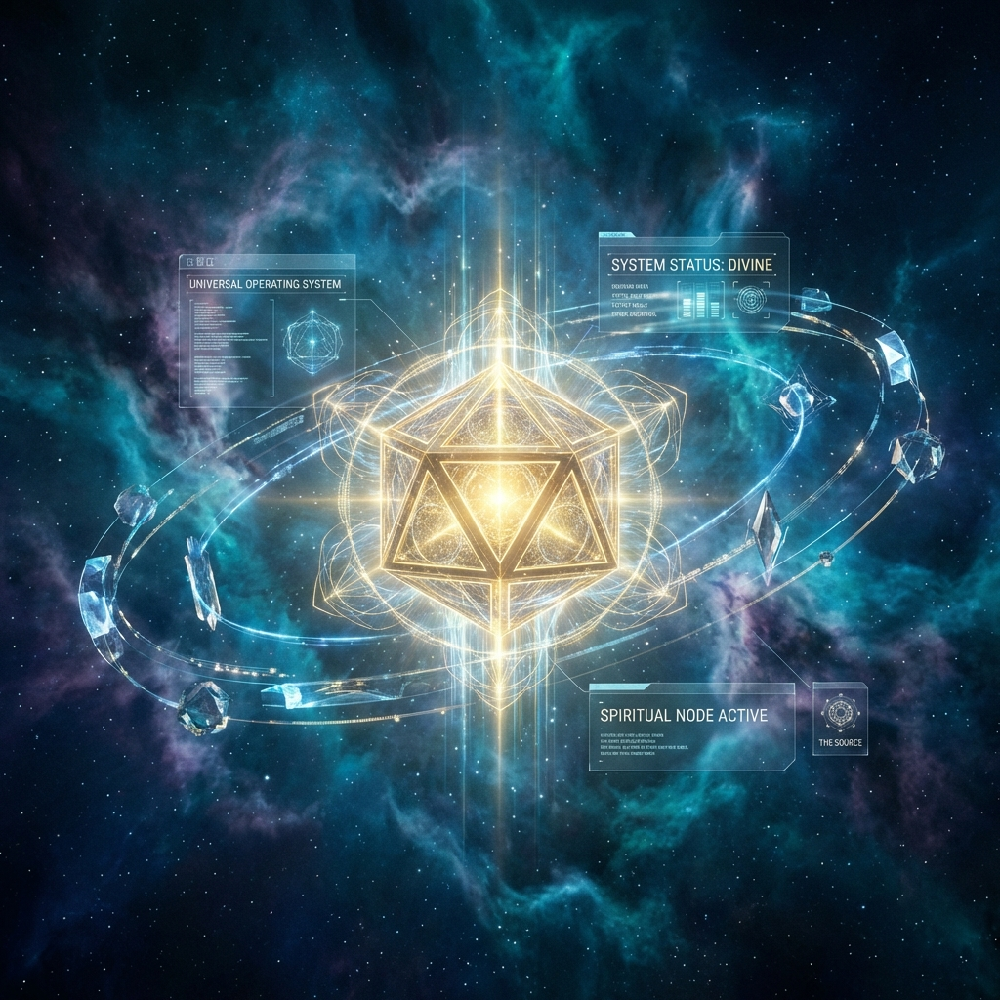

# 🌌 FAKKAF.COM - DIGITAL SANCTUARY
> **"Over it are Nineteen." (Müddessir, 30)**

## 🌠 The Vision: A Universal Operating System
**FAKKAF.COM**, siber güvenliğin soğuk algoritması ile mistik bir derinliğin (19 Kodu) kesiştiği noktada doğan bir **Evrensel İşletim Sistemi** (Universal OS) arayüzüdür. Burası bir web sitesi değil; derin uzayda ruhsal ve teknik bir arınma noktası, dijital bir sığınaktır.

### 🪐 The Celestial Interface
- **The Source:** Altın oranlı 12 yüzlü (Dodecahedron) merkez nesne. 19 algoritmasını yansıtan shader katmanlarıyla evrenin çekirdeğini temsil eder.
- **Orbital Navigation:** İmleç etkileşimiyle duran, kullanıcıya odaklanan akıllı navigasyon yörüngesi.
- **Nebula Interface:** GLSL shader tabanlı, imleç hareketine duyarlı akışkan etherik arka plan.
- **Audio Sanctuary:** Zihinsel berraklık için tasarlanmış 432Hz binaural vuruşlar.

---

## 🛡️ Secure by Design (The Architecture of the Void)
Sığınak, sadece görsel değil, mimari olarak da sarsılmaz bir temel üzerine inşa edilmiştir:

- **Encrypted Data Flow:** HUD üzerinde akan canlı sistem metrikleri ve entropi görselleştirmeleri.
- **Protective Simulations:** UI seviyesinde çalışan gerçek zamanlı Rate Limiter ve Brute-Force koruma simülasyonları.
- **Hardened Presence:** Docker orkestrasyonu, Nginx güvenlik mühürleri ve düşük yetkili süreç yönetimi (Non-privileged execution).

---

## 🛠️ Cosmic Tech Stack
- **Engine:** React + Vite (Experimental Rolldown Support)
- **Dimension:** Three.js / R3F / Drei
- **Vitality:** Zustand / Framer Motion
- **Design System:** Tailwind CSS v4

---

📧 **Contact the Architect:** [basvuru@fakkaf.com](mailto:basvuru@fakkaf.com)

*© 2026 Fakkaf Sanctuary - "Secure by Design - Bound by Spirit"*
